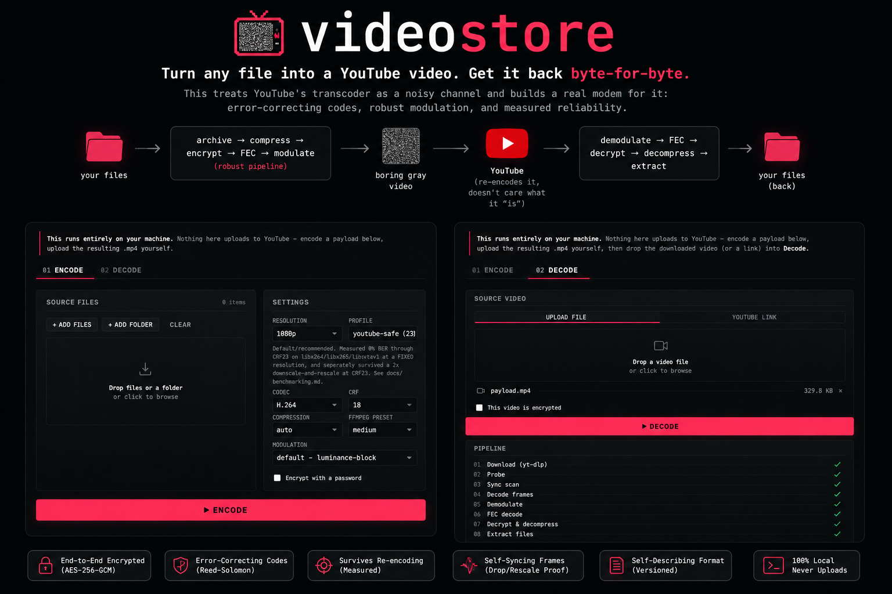

# videostore

<p align="center">
  <a href="https://github.com/dominikvytisk/videostore/actions/workflows/tests.yml"></a>
  
</p>

<p align="center">
  
</p>

**Turn any file into a YouTube video. Upload it. Wait for YouTube to
re-compress the hell out of it. Download it back. Get your file back
byte-for-byte.**

Not a zip renamed to `.mp4`. Not LSB pixel-hiding that dies the moment
YouTube touches it. This treats YouTube's transcoder as what it actually is:
a noisy communication channel. It's built like a real modem for that
channel, with a signal designed to survive re-encoding, error-correcting
codes on top, tuned by actually measuring what survives instead of
guessing.

## Why this exists

YouTube gives everyone unlimited video storage for free. This is what
happens when you take that literally and engineer it properly instead of
posting a "trick" that only works until the first re-upload.

## 60 seconds, no reading

```bash
pip install -e ".[web]"
brew install ffmpeg yt-dlp     # or your platform's equivalent
videostore serve                # → http://127.0.0.1:8420
```

Drag a folder in, hit Encode, upload the `.mp4` to YouTube yourself
(this tool never does it for you, see below), then paste the link back
into Decode. That's the whole product. See the screenshot above.

## Before you ask

**Does it actually survive YouTube's re-encoding?** Locally simulated
H.264/H.265/AV1 re-encodes at a range of quality levels: yes, measured, with
real numbers below. A real upload → YouTube → `yt-dlp` download round trip:
**you have to test that yourself**. This project deliberately never
automates uploading (no credentials, ever), so that specific claim is
untested by us on purpose. See [the honest gap](docs/youtube-channel.md).

**Is this against YouTube's ToS?** Read YouTube's terms yourself before
uploading anything with this. This is a research/personal-use tool, not a
sanctioned storage product. Treat one video like one file on a disk you
don't fully control: fine for a backup or a fun experiment, not something to
build a business on.

**Is my data safe if someone finds the video?** Only if you pass
`--password` (Argon2id + AES-256-GCM/ChaCha20-Poly1305, real AEAD, not a
XOR cipher). Without a password, anyone with the link can decode it. The
video itself doesn't try to look like anything other than what it is.

**Why does the video look like TV static?** Because the entire frame *is*
the payload: there's no cover footage to hide inside, so it's an obviously
synthetic, deliberately boring gray pattern. This is a storage tool, not
steganography for concealment.

## The interesting part (for the skeptics)

The original design assumed DCT coefficient tricks (classic robust
watermarking) would be the strongest way to survive compression, with
simple pixel-averaging expected to get destroyed. **Measuring it said the
opposite:**

| modulation | CRF 18 | CRF 23 | CRF 28 | CRF 32 |
|---|---|---|---|---|
| DCT coefficient pairs | 0.00% | 0.49% | 6.90% | **49.9% (coin flip)** |
| block-average luminance | 0.00% | 0.00% | 0.00% | **0.00%** |

(Bit-error rate, real `ffmpeg libx264` round trip. Full sweep, including
H.265, AV1, resolution downscale, and more coefficient variants, in
[docs/benchmarking.md](docs/benchmarking.md).) Turns out when you get to
design your own cover frame instead of hiding in someone else's footage,
brute-force averaging a big flat region beats clever coefficient math,
because deblocking filters and adaptive block partitioning exist specifically
to smooth out the kind of fine structure the clever version relies on. Full
writeup, with the reasoning and the failed attempts: [docs/architecture.md](docs/architecture.md).

## What's actually in here

Not a weekend hack: full pipeline with FEC and a real protocol.

```
files → binary archive (own format, checksummed) → zstd (auto-skips
incompressible data) → AES-256-GCM/ChaCha20-Poly1305 (Argon2id KDF, chunked
AEAD) → Reed-Solomon FEC → burst-error interleaving → block-average
luminance modulation → ffmpeg → .mp4
```

- **Self-describing, versioned protocol**: the decoder never needs you to
  remember what settings you encoded with.
- **Per-frame self-location**: tolerates dropped/duplicated/reordered
  frames (fps conversion does this) via a tiny synchronization tag on every
  single frame, not sparse checkpoints.
- **Resolution-change recovery**: if YouTube serves you a different
  resolution than you uploaded, the decoder figures that out and rescales.
- **Partial recovery**: a damaged video gives you back whatever files it
  can, with per-file integrity checks, not all-or-nothing.
- **Local web UI** with live per-stage pipeline progress over a websocket,
  drag-and-drop folders, inline file preview, and direct YouTube-link
  decoding (still never uploads for you).
- **A benchmark suite** that actually runs encode → channel → decode →
  compare and produces JSON/CSV/HTML reports, because "trust me" isn't a
  spec.
- **60 automated tests**, including ones that cut real frames out of a real
  encoded video and check recovery still works.

## Install

```bash
python3 -m venv .venv && source .venv/bin/activate
pip install -e .
pip install -e ".[web]"       # optional: the drag-and-drop web UI
brew install ffmpeg yt-dlp    # or your platform's equivalent
```

## CLI

```bash
videostore encode ./my_files -o payload.mp4 --resolution 1080p --profile youtube-safe --encrypt

# upload payload.mp4 to YouTube yourself (this tool never does it for you)

videostore decode --youtube-url "https://youtube.com/watch?v=XXXXXXXX" -o ./restored
# or, if you already downloaded it:
videostore decode downloaded.mp4 -o ./restored --ask-password
```

Also: `videostore inspect`, `videostore benchmark`, `videostore
test-channel`, `videostore serve`, `videostore pack`/`unpack`. `--help` on
any of them.

## Reality check

Four reliability profiles trade capacity for redundancy
(`--profile maximum-capacity|balanced|youtube-safe|maximum-reliability`).
`youtube-safe` is the default and is measured clean through CRF 32 at a
fixed resolution. But stacking a big resolution downgrade *and* heavy
compression **at the same time** beat it in testing (Reed-Solomon actually
miscorrected, caught by a checksum, not silently wrong). Use
`maximum-reliability` if you don't control what YouTube will do to your
upload. Full numbers, including that failure: [docs/benchmarking.md](docs/benchmarking.md).

## Docs

- [docs/architecture.md](docs/architecture.md): the design, the experiment, why each layer exists
- [docs/protocol.md](docs/protocol.md): the binary format, byte for byte
- [docs/youtube-channel.md](docs/youtube-channel.md): the channel simulator, the yt-dlp workflow, what's unverified
- [docs/benchmarking.md](docs/benchmarking.md): every measured number and how to reproduce it
- [docs/security.md](docs/security.md): threat model, crypto choices
- [docs/web-ui.md](docs/web-ui.md): the local web UI
- [docs/development.md](docs/development.md): project layout, how to extend a layer
- [docs/troubleshooting.md](docs/troubleshooting.md): known limitations

## Example

```bash
videostore decode examples/sample_encoded.mp4 -o /tmp/restored
diff -r examples/testdata /tmp/restored/testdata   # empty output = it worked
```

---

Every layer sits behind a narrow interface: swap the modulation scheme, the
FEC code, or the video codec without touching the rest. See
[docs/development.md](docs/development.md) if you want to try beating
`luminance-block`.
